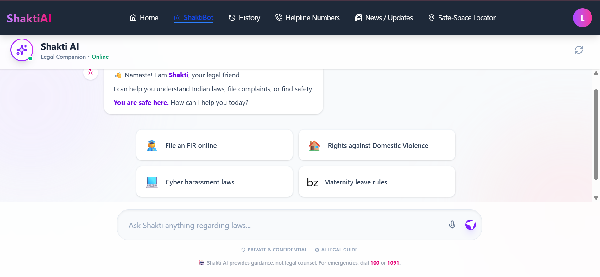

# ⚖️ Shakti AI — Your Legal Companion & Safety Guardian



**Shakti AI** is a comprehensive legal assistant and safety platform designed to empower women in India. By combining **Generative AI** with real-time location services, it demystifies complex Indian laws (BNS, 2023) and provides immediate access to emergency resources.

## 🚀 Live Demo
[**Click here to view the Live Deployment**](https://shaktiai-kd.onrender.com/HomePage) 

---

## ✨ Key Features

### 🤖 AI Legal Advisor (RAG-Powered)
- **Context-Aware Answers:** Uses **Retrieval-Augmented Generation (RAG)** to provide accurate legal advice based on actual Indian legal documents (Bharatiya Nyaya Sanhita, Domestic Violence Act, etc.).
- **Voice-Enabled:** Supports **Voice-to-Text** input for hands-free interaction, making it accessible to all literacy levels.
- **Multilingual Support:** Capable of understanding and responding in multiple Indian languages (powered by translation layers).

### 📍 Safe Space Locator
- **Real-Time Mapping:** Instantly locates nearby **Police Stations, Hospitals, and NGOs** within a 3km radius.
- **Privacy First:** Uses **Overpass API (OpenStreetMap)**, requiring no user tracking or data storage.

### 📰 Legal Awareness Hub
- **Live Legal News:** Fetches real-time updates on court rulings, women's rights amendments, and government schemes using the **GNews API**.
- **Categorized Feeds:** Filters news by "Supreme Court," "Women's Safety," and "Cyber Laws."

### 🆘 Emergency Support
- **One-Tap Helplines:** A dedicated directory of critical emergency numbers (1091, 100, etc.).

---

## 🛠️ Tech Stack

### Frontend
- **Framework:** React.js + Vite
- **Styling:** Tailwind CSS + Framer Motion (Animations)
- **Icons:** Lucide React
- **State Management:** React Context API
- **Maps:** Leaflet / Overpass API

### Backend
- **Server:** Node.js + Express.js
- **Database:** MongoDB (Mongoose)
- **AI Engine:** LangChain + Groq SDK
- **Authentication:** JWT (JSON Web Tokens)
- **Security:** CORS, Environment Config

### AI & APIs
- **LLM Model:** Llama-3 (via Groq)
- **Vector Store:** In-memory / FAISS (for RAG context)
- **News Service:** GNews API
- **Speech API:** Native Web Speech API

---

# Project Structure
```Bash

shaktiai/
├── backend/
│   ├── src/
│   │   ├── controllers/   # Logic for Chat, Auth, News
│   │   ├── models/        # MongoDB Schemas (User, News)
│   │   ├── routes/        # API Endpoints
│   │   ├── utils/         # RAG Setup, LangChain Logic
│   │   └── data/          # PDFs of Indian Laws (Knowledge Base)
│   └── index.js           # Server Entry Point
│
└── frontend/
    ├── src/
    │   ├── components/    # Reusable UI (Chatbot, Maps, Cards)
    │   ├── pages/         # Main Views (Home, SafeSpace, Login)
    │   ├── context/       # Auth State Management
    │   └── services/      # API Calls (Axios)
    └── main.jsx
```
